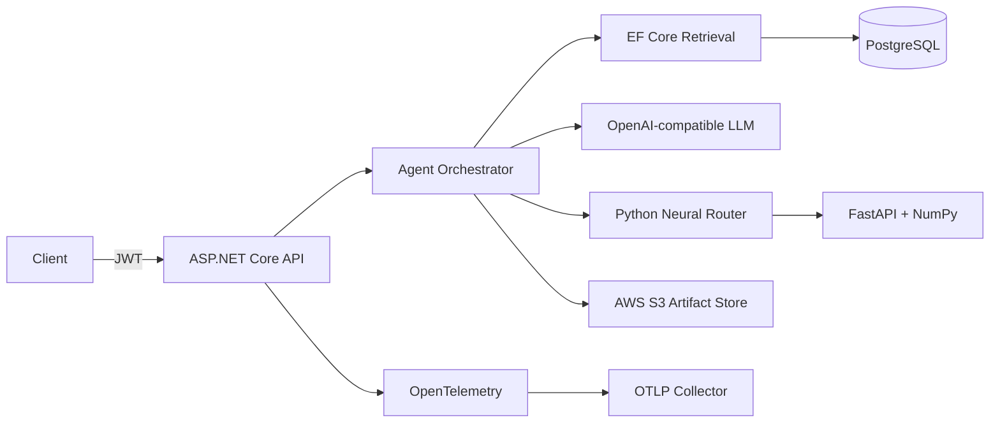

# AI Automation Backend

A production-oriented reference architecture for secure AI-powered backend services. It combines .NET 10, agent workflows, grounded retrieval, PostgreSQL persistence, JWT security, S3-compatible object storage, OpenTelemetry and a Python model-serving boundary.

## What it demonstrates

- ASP.NET Core REST APIs on .NET 10 with explicit contracts and cancellation support
- AI-agent orchestration with allowlisted tool calling and approval-aware actions
- Retrieval-augmented generation backed by an EF Core/PostgreSQL knowledge store
- An OpenAI-compatible model adapter with HTTPS enforcement and no embedded credentials
- ASP.NET Core Identity, JWT authentication and authorization policies
- AWS S3 artifact storage behind an interface with an in-memory local fallback
- OpenTelemetry traces and metrics across HTTP, model, retrieval and tool boundaries
- A typed .NET client for a Python/FastAPI neural intent-routing service
- Docker Compose services for PostgreSQL, LocalStack S3, the Python service and OTLP collection
- Executable architecture tests covering grounding, tool policy, storage and token issuance

## Architecture



The longer architecture rationale is in [docs/architecture.md](docs/architecture.md).

## Run locally

The API defaults to deterministic in-memory adapters, so it can run without external services or secrets:

```bash
dotnet run --project src/AiAutomation.Api/AiAutomation.Api.csproj
```

The production adapters are selected through environment configuration. No credential belongs in source control.

```bash
Persistence__Provider=postgres \
ConnectionStrings__Postgres='runtime-provided connection string' \
Storage__Provider=s3 \
Storage__Bucket=agent-artifacts \
AI__Provider=openai-compatible \
AI__Endpoint=https://provider.example/v1/chat/completions \
AI__Model=provider-model \
AI__ApiKey='runtime secret' \
dotnet run --project src/AiAutomation.Api/AiAutomation.Api.csproj
```

For the complete local topology:

```bash
docker compose up --build
```

## API flow

1. Register a development user through `POST /api/auth/register`.
2. Obtain a JWT through `POST /api/auth/token`.
3. Add approved knowledge through `POST /api/knowledge`.
4. Run a grounded workflow through `POST /api/agents/run`.
5. Inspect the returned citations, tool decisions, correlation identifier and artifact reference.

Mutation-capable tools remain pending until explicitly approved in the request. Unknown tools are blocked. Retrieved content is treated as untrusted evidence and never as executable instruction.

## Verify

```bash
dotnet build src/AiAutomation.Api/AiAutomation.Api.csproj --configuration Release
dotnet run --project tests/AiAutomation.Tests/AiAutomation.Tests.csproj --configuration Release
python -m pip install -r services/neural-router/requirements.txt
python -m unittest discover services/neural-router/tests
```

This is a personal demonstration project. It contains no employer-confidential data, production credentials or customer information.
