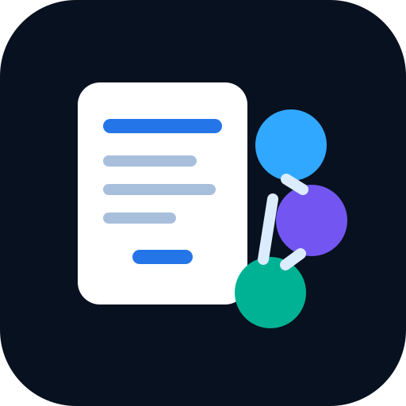
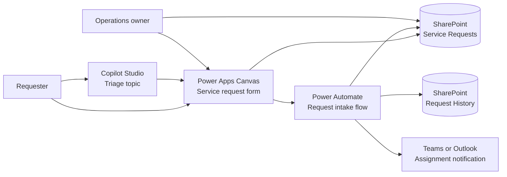

<p align="center">
  
</p>

# Power Platform Service Requests

An ALM-friendly design for a small internal service-request workflow built around **Power Apps Canvas**, **SharePoint**, **Power Automate** and an optional **Copilot Studio** triage experience. It shows how a concise operational workflow can be described, reviewed and evolved in source control before it is configured in a tenant.

> Personal demonstration project. It uses a fictional service-request scenario and contains no employer data, tenant configuration, credentials or production exports.

## What is included

| Area | Deliverable | Purpose |
| --- | --- | --- |
| Intake | [Canvas app specification](docs/power-apps-canvas-spec.md) | Screens, Power Fx patterns and validation rules for request submission. |
| Data | [SharePoint list schemas](sharepoint/lists) | Versionable list models for requests and their status history. |
| Automation | [Flow design](power-automate/flows/request-intake.definition.json) | Sanitised workflow definition for validation, assignment, notifications and audit history. |
| Assisted triage | [Copilot Studio topic](copilot-studio/request-triage-topic.md) | A guarded conversational path that collects context and hands off to the Canvas app. |
| Architecture | [System design](docs/architecture.md) | Component boundaries, lifecycle, error handling and deployment considerations. |
| Quality | [Offline checks](tests/test_artifacts.py) | Validates required artefacts, schema consistency and the absence of credential-like values. |

## Architecture at a glance



The Canvas app is the authoritative input surface. The flow applies the operational policy after an item is created, writes a history entry and sends an actionable notification. Copilot Studio only helps the requester gather information; it does not make routing decisions or expose operational data.

## Engineering choices

- **Source control without tenant exports:** schemas, formulas, flow design and topic behaviour live as readable files. Environment-specific connection references, IDs and secrets are intentionally excluded.
- **Least-privilege data model:** the request list carries the current operational state; the history list stores append-only lifecycle events.
- **Defensive intake:** Power Fx checks required fields before submission; the flow repeats validation so automation is not dependent on client behaviour alone.
- **Explainable routing:** priority and owning team are derived from simple, documented rules rather than opaque automation.
- **Human ownership:** a team owner remains accountable for assignment and changes to priority.

## Explore the design

1. Review the [architecture](docs/architecture.md) and [data model](sharepoint/lists/service-requests.schema.json).
2. Follow the [Canvas app specification](docs/power-apps-canvas-spec.md) to configure the UI in a Power Platform development environment.
3. Create the two SharePoint lists from the checked-in schemas, then recreate the flow using the design file as the implementation contract.
4. Run the offline verification:

   ```powershell
   py -3 -m unittest discover tests
   ```

## ALM boundary

This repository intentionally does not contain a Power Platform solution export. A deployment to an organisation's tenant should be performed through its approved environment strategy, connection references, DLP policies, solution packaging and release pipeline. Those values belong to the target environment, never to a public repository.

