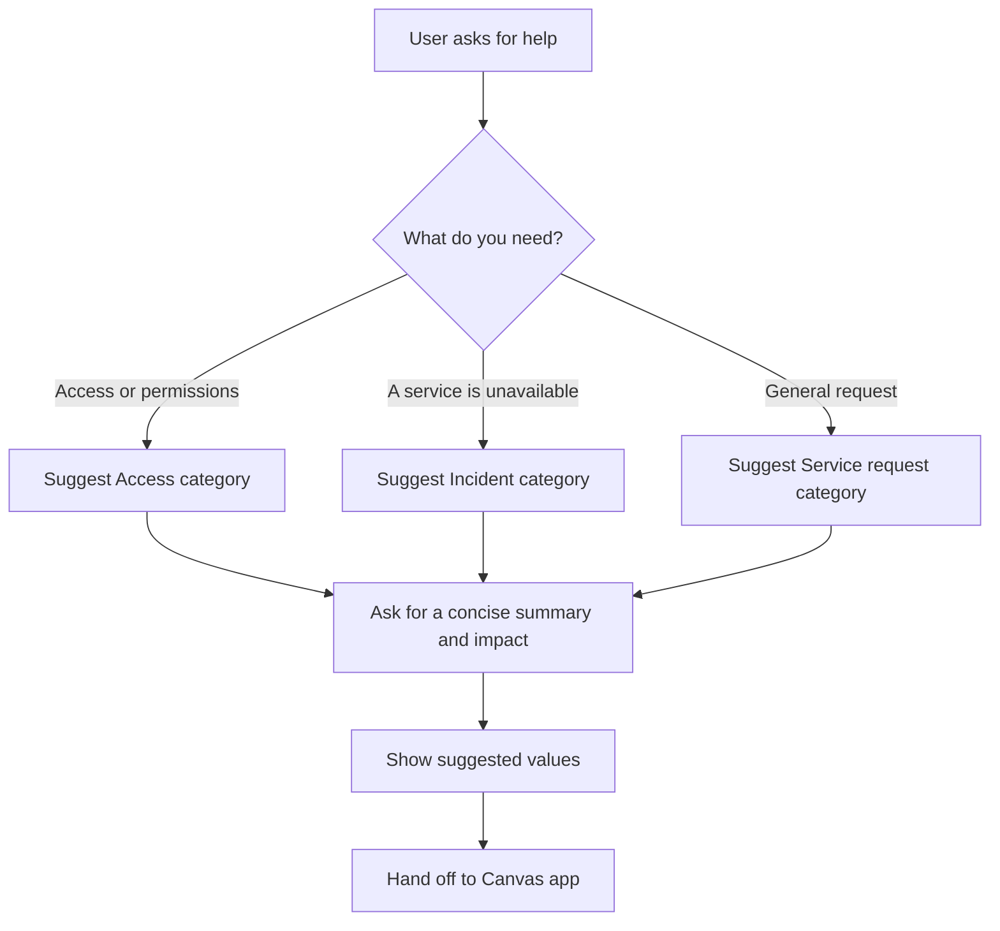

# Request triage topic

## Goal

Help a requester choose a request category and write a concise summary before handing off to the Canvas app. This topic is optional; the Canvas app remains the only path that creates a request.

## Conversation outline

## Guardrails

- Do not claim a request has been submitted.
- Do not query SharePoint, infer user permissions or expose existing requests.
- Do not collect passwords, authentication codes, payment data or sensitive personal information.
- If the user reports an urgent service outage, explain the emergency escalation route defined by the organisation rather than attempting a diagnosis.
- Treat the final app submission as user-confirmed input.

## Handoff payload

| Field | Source | Validation |
| --- | --- | --- |
| Suggested category | Guided selection | One of the Canvas app categories. |
| Suggested summary | User's own wording | Maximum 120 characters. |
| Suggested impact | Guided selection | Low, Normal or High. |

The implementation should use the organisation's approved Copilot Studio environment and governance policies. No tenant identifiers, connection values or topic exports are stored here.

