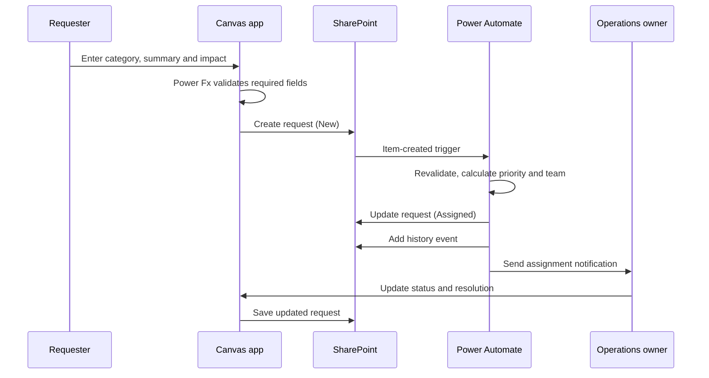

# System architecture

## Purpose

The workflow accepts an internal service request, validates the information, assigns an initial owner and leaves a small audit trail. It is deliberately scoped to a familiar business process so that the design can focus on platform decisions rather than a fictional product domain.

## Components and responsibility boundaries

| Component | Responsibility | Does not do |
| --- | --- | --- |
| Power Apps Canvas | Collects a request, validates user input and shows the requester's own items. | Store connection secrets or decide operational policy. |
| SharePoint: Service Requests | Holds the current state of each request. | Act as an event log or expose items beyond the configured audience. |
| Power Automate | Validates the created item, assigns an owner, records history and notifies the team. | Replace human approval for exceptional routing. |
| SharePoint: Request History | Stores immutable status transitions and automation outcomes. | Contain customer content not required for the audit event. |
| Copilot Studio | Helps the requester choose a category and prepare a concise description. | Read operational lists or change a request. |
| Teams or Outlook | Delivers an actionable owner notification. | Become the system of record. |

## Request lifecycle

## Routing policy

The example uses intentionally simple rules that can be reviewed by operations staff:

| Condition | Initial priority | Owner team |
| --- | --- | --- |
| Service unavailable or business impact marked high | High | Platform Operations |
| Access, account or permissions request | Normal | Identity and Access |
| All other categories | Normal | Service Desk |

An owner can amend the assignment or priority. That decision should add a history entry with a reason.

## Error handling

- The Canvas app shows a clear save error and retains the requester's entered values until the save succeeds.
- The flow records `AutomationFailed` in the history list if its update or notification step cannot complete.
- A flow failure must not silently change the request state to `Assigned`.
- Retrying should be safe: history events use a workflow run identifier to detect an accidental duplicate.

## Deployment and governance

1. Create development, test and production environments according to the organisation's Power Platform governance model.
2. Configure least-privilege SharePoint permissions and separate maker, owner and requester roles.
3. Apply DLP policies before connections are created.
4. Create connection references within the target environment; do not check them into this repository.
5. Package the configured assets in a managed solution only through the organisation's approved release process.
6. Test the failure path, notification permissions and delegated access before production release.

