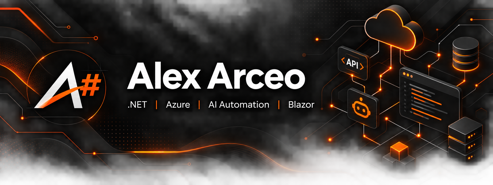
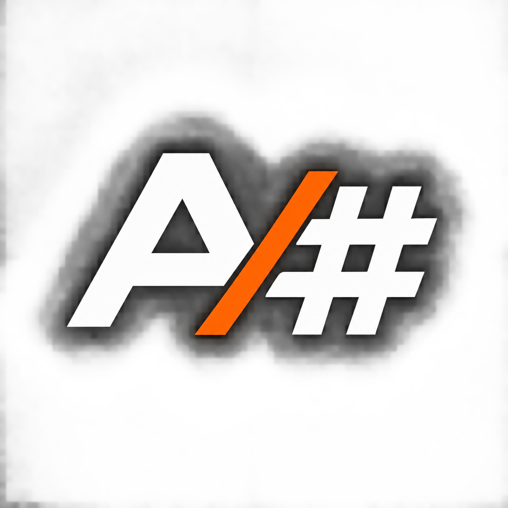

  

# Alex Arceo | .NET, Azure and AI Automation

Backend-focused software developer building secure APIs, cloud-ready integrations and practical automation with the Microsoft stack. This portfolio turns architecture decisions into runnable code, tests and deployment assets.

## Selected engineering evidence

| Project | What it demonstrates | Verification |
| --- | --- | --- |
| [AI Automation Backend](08-ai-automation-backend) | .NET 10 AI agents, RAG, EF Core/PostgreSQL, Identity/JWT, AWS S3, OpenTelemetry and a Python neural-routing service | Executable .NET and Python tests plus compose topology |
| [Intelligent Commerce Platform](04-intelligent-commerce-platform) | .NET 10 payments API, PostgreSQL/EF Core persistence, idempotency, signed webhooks, explainable risk rules, Docker and Azure Bicep | Executable domain tests and compose environment |
| [Agentic Knowledge Hub](05-agentic-knowledge-hub) | Grounded retrieval, pgvector/Qdrant, approval-aware agents, external model integration and Python/.NET evaluation | Executable Python, safety, workflow and retrieval tests |
| [Blazor Delivery Dashboard](03-blazor-delivery-dashboard) | Blazor UI, API integration and delivery-oriented presentation | Release build in CI |
| [AI Workflow Integration](02-ai-workflow-integration) | Provider-neutral orchestration, explicit tools and safe outputs | Release build in CI |
| [ASP.NET Core API](01-aspnet-core-api) | Minimal APIs, validation and integration testing | xUnit API test in CI |
| [Commerce Companion](06-commerce-companion) | Native .NET MAUI client for the commerce API with validation and safe HTTP boundaries | Windows release build in CI |
| [Industrial Telemetry Platform](07-industrial-telemetry-platform) | MQTT ingestion, simulated equipment, append-only events and an interactive Blazor operations dashboard | Executable rules and persistence tests |

## Technical focus

`C#` · `.NET 10` · `ASP.NET Core` · `Python` · `FastAPI` · `REST APIs` · `AI agents` · `RAG` · `JWT` · `EF Core` · `PostgreSQL` · `AWS S3` · `SQL Server` · `Azure` · `Blazor` · `.NET MAUI` · `MQTT` · `Docker` · `Kubernetes` · `OpenTelemetry` · `CI/CD` · `Power Platform` · `AI integrations`

## Quality gates

Every public increment is expected to pass:

- Release builds for all backend and web projects plus the MAUI Windows client.
- API integration tests plus executable commerce and knowledge-hub tests.
- A repository audit that rejects private operating material, secrets and unintended metadata.
- GitHub Actions validation on pushes and pull requests.

## Explore locally

Each project contains focused run instructions. A quick repository-wide validation can be reproduced by running the build and test commands defined in [the CI workflow](.github/workflows/ci.yml).

## Scope

These are personal demonstration projects, separate from professional employment experience. They contain no employer-confidential information, credentials or production data.
